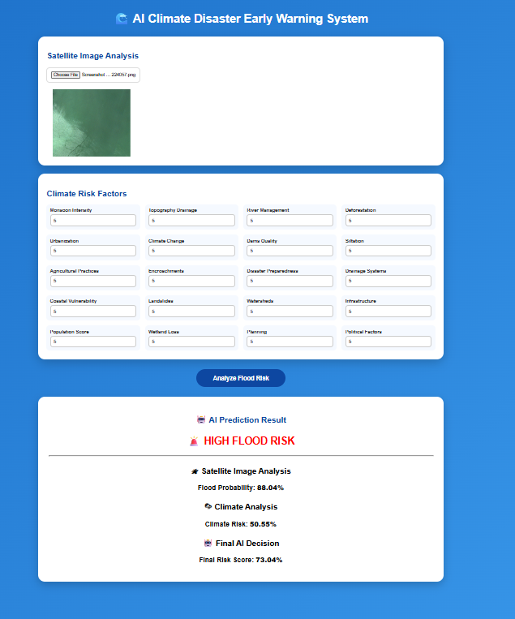
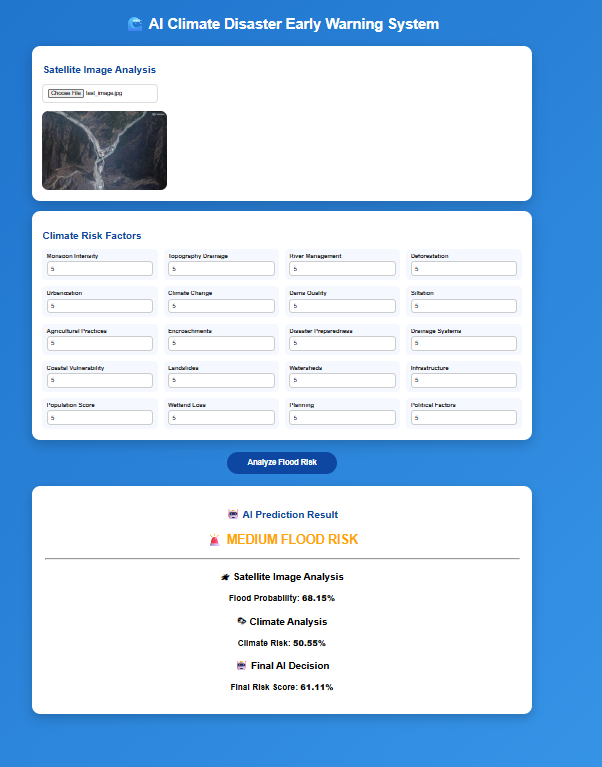
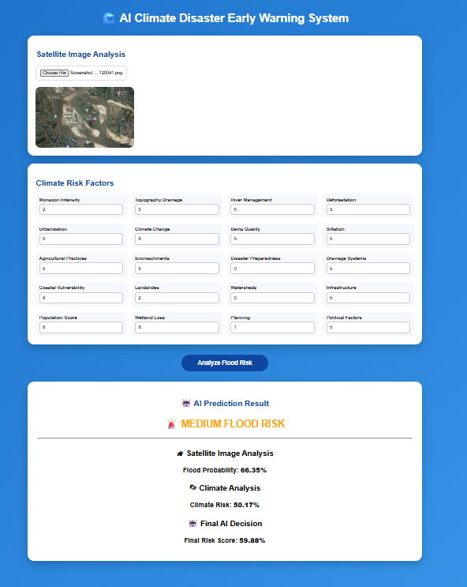
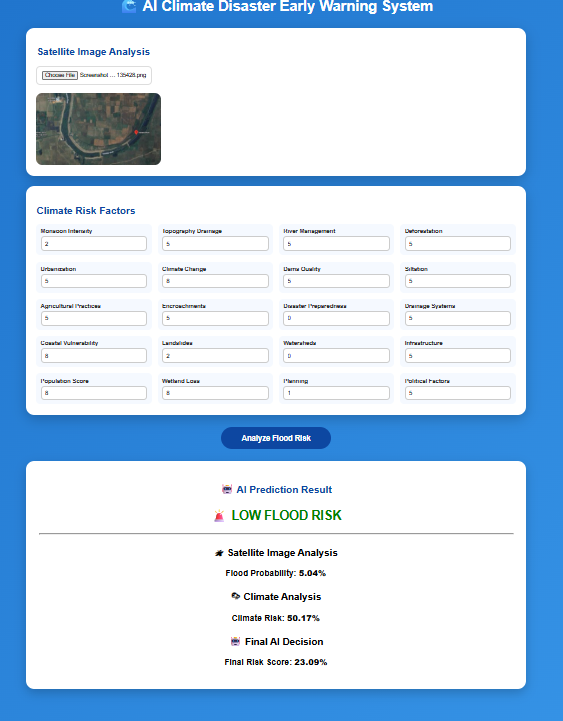

# 🌊 AI Climate Disaster Early Warning System

An AI-powered flood risk prediction system that combines **satellite image analysis** and **climate risk factors** to provide early flood warnings.

The system uses **Deep Learning and Machine Learning techniques** to analyze environmental conditions and estimate flood probability.

---

# 🚀 Features

- 🛰 Satellite image based flood detection
- 🌦 Climate risk factor analysis
- 🤖 AI-based flood probability prediction
- 📊 Combined risk score generation
- 🚨 Flood warning classification
- 🌐 Interactive web interface


---

# 🏗️ System Architecture


```
                 User Input

                     |
                     |

        Satellite Image + Climate Data

                     |
                     |

              Deep Learning Model
                  (MobileNetV2)

                     |
                     |

              Climate Risk Model

                     |
                     |

              Risk Score Fusion

                     |
                     |

             Flood Warning Result
```


---

# 🧠 Machine Learning Workflow


```
Input Data

     ↓

Data Preprocessing

     ↓

Feature Extraction

     ↓

Deep Learning Image Analysis

     ↓

Climate Risk Evaluation

     ↓

Prediction Fusion

     ↓

Flood Risk Classification
```


---

# 📂 Project Structure


```
AI-Climate-Disaster-Early-Warning-System

│
├── backend
│   │
│   ├── app.py
│   │
│   ├── models
│   │   ├── flood_detection_mobilenetv2.keras
│   │   ├── flood_model.json
│   │   └── config.json
│   │
│   └── uploads
│
│
├── frontend
│   ├── index.html
│   ├── script.js
│   └── style.css
│
│
├── screenshots
│   ├── high-risk.png
│   ├── medium-risk-1.png
│   ├── medium-risk-2.png
│   └── low-risk.png
│
│
├── requirements.txt
│
└── README.md

```


---

# 🛠️ Technologies Used


## Backend

- Python
- Flask
- Flask REST API


## Machine Learning

- TensorFlow
- Keras
- MobileNetV2
- Scikit-learn


## Frontend

- HTML5
- CSS3
- JavaScript


---

# ⚙️ Installation Guide


## Clone Repository


```bash
git clone https://github.com/Tahmid19710/AI-Climate-Disaster-Early-Warning-System.git
```


Go to project directory:


```bash
cd AI-Climate-Disaster-Early-Warning-System
```


---

## Create Virtual Environment


```bash
python -m venv .venv
```


Activate environment:


### Windows

```bash
.venv\Scripts\activate
```


---

## Install Dependencies


```bash
pip install -r requirements.txt
```


---

# ▶️ Run Backend


Go to backend directory:


```bash
cd backend
```


Run Flask server:


```bash
python app.py
```


Backend will start:

```
http://127.0.0.1:5000
```


---

# ▶️ Run Frontend


Open:

```
frontend/index.html
```


or use VS Code Live Server extension.


---

# 📊 Prediction Output


The system provides:


- Satellite Image Probability
- Climate Risk Score
- Final Risk Score
- Flood Warning Level


Example:


```
Satellite Probability: 68.15%

Climate Risk: 50.55%

Final Score: 61.11%

Warning:
MEDIUM FLOOD RISK
```


---

# 🖥️ System Screenshots


## 🔴 High Flood Risk Prediction




---

## 🟠 Medium Flood Risk Prediction







---

## 🟢 Low Flood Risk Prediction




---

# 🔌 API Endpoint


## Flood Prediction API


Method:

```
POST
```


Endpoint:

```
/final_prediction
```


Input:

- Satellite Image
- Climate Risk Parameters


Output:


```json
{
    "image_probability":0.68,
    "climate_risk":0.50,
    "final_score":0.61,
    "warning":"MEDIUM FLOOD RISK"
}
```


---

# 👨‍💻 Developer


**Tahmid Anjum**

AI / Machine Learning Developer


---

# 📌 Future Improvements


- Real-time satellite data integration
- Weather API integration
- GIS based flood mapping
- Real-time disaster alert system
- Mobile application development


---

⭐ If you find this project useful, consider giving it a star on GitHub.